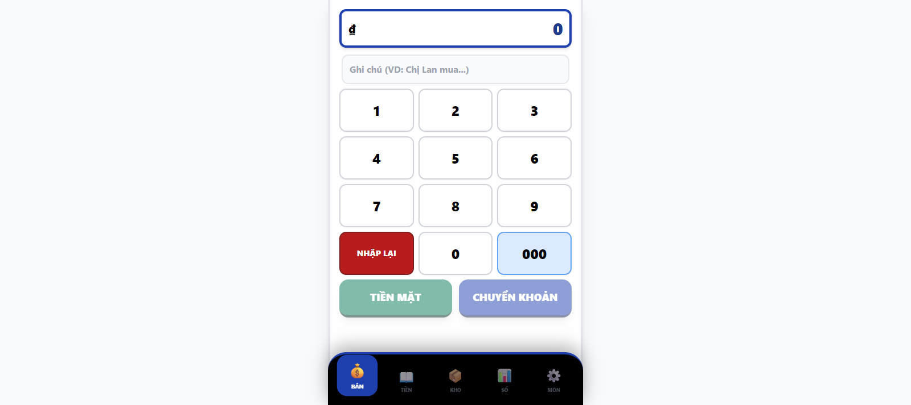
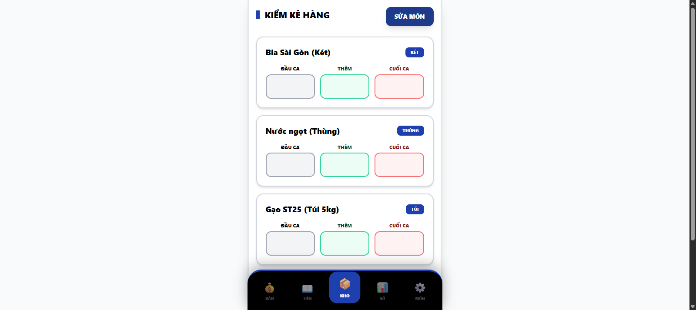
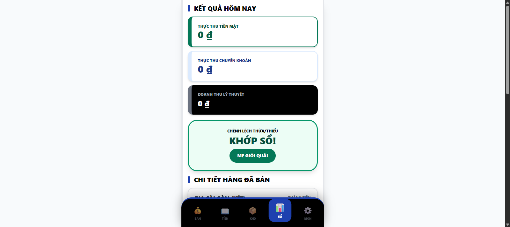
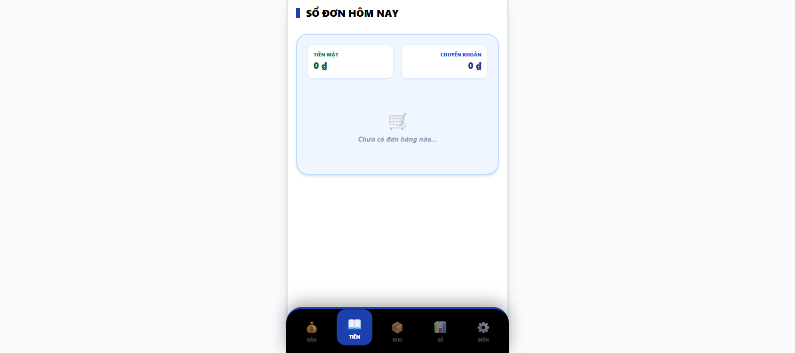
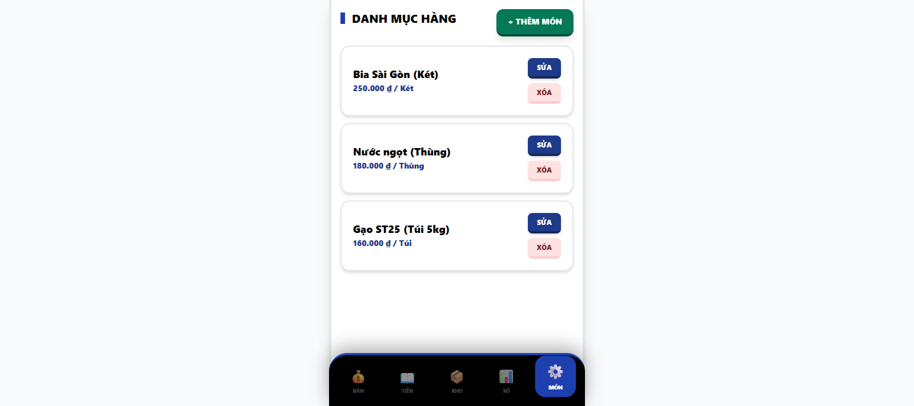

# Mẹ Quản Lý Bán Lẻ 🏪

Ứng dụng quản lý bán hàng siêu đơn giản, được thiết kế riêng để mẹ dễ dàng sử dụng trên điện thoại.

## Tính Năng Chính 🌟

- **Giao diện to, rõ ràng**: Chữ to, nút bấm lớn, dễ thao tác.
- **Hoạt động Offline**: Không cần mạng internet vẫn bán hàng bình thường.
- **Cài đặt như App (PWA)**: Có thể đưa icon ra màn hình chính, mở nhanh không cần vào trình duyệt.
- **Quản lý kho đơn giản**: Kiểm soát hàng nhập/xuất mỗi ngày.
- **Báo cáo doanh thu**: Tự động tính toán doanh thu tiền mặt và chuyển khoản.

## Hình Ảnh Minh Họa 📸

### 1. Màn hình BÁN HÀNG 💰
Nhập số tiền nhanh chóng, hỗ trợ tính toán và hiển thị mã QR.

### 2. Kiểm Kê KHO 📦
Theo dõi số lượng hàng hóa đầu ca và cuối ca dễ dàng.

### 3. SỔ Báo Cáo 📊
Xem chi tiết doanh thu và chênh lệch tiền trong ngày.

### 4. Lịch Sử Giao Dịch 📖
Xem lại các đơn hàng đã bán trong ngày.

### 5. Quản Lý Món Hàng ⚙️
Thêm, sửa, xóa các mặt hàng trong cửa hàng.

## Cách Cài Đặt Trên Điện Thoại 📲

### Trên iPhone (iOS)
1. Mở trang web bằng trình duyệt **Safari**.
2. Bấm vào nút **Chia sẻ** (hình vuông có mũi tên đi lên).
3. Chọn **"Thêm vào MH chính"** (Add to Home Screen).

### Trên Android (Samsung, Oppo...)
1. Mở trang web bằng trình duyệt **Chrome**.
2. Bấm vào dấu **3 chấm** ở góc trên bên phải.
3. Chọn **"Cài đặt ứng dụng"** hoặc **"Thêm vào màn hình chính"**.

---
*Chúc mẹ buôn may bán đắt! ❤️*
